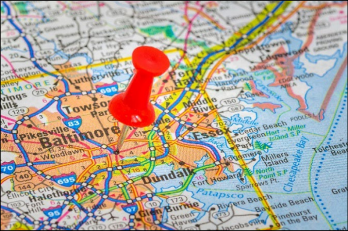

| ©2025 by COMAP, Inc. | [www.comap.org](http://www.comap.org) | [www.mathmodels.org](http://www.mathmodels.org) | info@comap.org |
|----------------------|---------------------------------------|-------------------------------------------------|----------------|

> 本文翻译自[原文](ORIGINAL.md)，仅供参考。原文版权归COMAP公司所有，转载请注明出处。

# 2025 ICM (问题D): 通往更美好城市的路线图

## 问题背景

**交通系统既能推动城市的发展，也可能给居民的生活带来困扰。**

一套高效的交通**基础设施**能吸引企业、学校、游客及新居民的到来。然而，城市所面临的交通问题是复杂且紧密相连的。
不同的利益相关者（如城市居民、商户、郊区居民、通勤者、**过境**旅客、游客等）在交通系统中的需求和优先级各不相同。
而通常在交通系统中的某些环节会选择先满足某一方的需求，但也同时妨碍、影响了其他人的需求。

> 例如在高速公路、公交路线和铁路系统可能会干扰到城市的骑行者和行人，反过来，当机动车在城市人行道或信号灯前遭遇延误时，也会对交通流畅性造成影响。

有时候，城市地理环境本身也可能成为交通流畅的最大障碍——例如水域（如河流、港口、溪流和排水沟）或地形（如丘陵、沟渠、山谷、斜坡）。
甚至土壤的构成和天气条件也可能成为干扰因素。

## 情景描述

**美国马里兰州** 的 **Baltimore** 市正面临着基础设施老化和交通选择有限的问题，而这些问题影响着市民的生活，并妨碍了其经济增长。
此外，近期其主要的一座桥梁（弗朗西斯·斯科特·基桥）发生倒塌，切断了通往繁忙港口的主要高速公路。

因此，Baltimore市正计划通过改善基础设施和增强公共交通来优化其交通架构，以支持其继续实现可持续发展目标——
依赖于分析及优先处理和实施各项计划，如增强多方合作、维护和更新基础设施、高效利用数据，以及寻求其他能够提升市民和游客生活质量的技术升级。

**Baltimore** 是一个繁忙的港口和航运中心，且位于主要州际高速公路（I-95）沿线。
市内多个过境和通勤高速公路及铁路线路阻碍或干扰了街道和社区的交通，使得城市居民难以获得进入航运行业工作的机会，且使得本地商户在运输货物和进出周边社区时也受到影响。
Baltimore规划了修复道路、建设绕行道路、扩展公共交通选项，并改善港口和机场的通行条件等举措，期望能促进商业活动，使城市成为一个更适宜居住、工作和旅游的地方。

就在最近，借助全国性资金和支持，美国的多个城市已提出基础设施计划，旨在拆除分隔社区与市中心的高速公路，并以重新连接和振兴这些区域的方式替代它们。
虽然这些高速公路方便郊区居民往返市中心或城市内的工作地点，但在这些高速公路的建设过程中，城市社区被分割或摧毁。
Baltimore希望能够重新连接这些社区，提供更多可持续的社区，包括更多绿地、更好的公共住房以及社区娱乐和休闲的机会。

以下是四个交通问题的例子，更实际、直接地暴露出了这些问题：
1. **重新修建倒塌的港口桥梁**（弗朗西斯·斯科特·基桥）。[[1]](https://www.constructconnect.com/construction-economic-news/rebuild-of-baltimores-key-bridge-to-start)  
2. **公共铁路系统的不足**（MARC、轻轨、重轨），这些系统连接着已经拥有多种交通选择的郊区。
   这些铁路系统无法充分支持通勤者和居民便捷地利用系统前往工作地点，而市区的免费公交主要为游客服务，而非市区居民。[[2]](https://www.scirp.org/journal/paperinformation?paperid=138654)  
3. 通过西Baltimore联合项目 _（West Baltimore United Project）_ **规划修复美国40号公路**（“通向无处的高速公路”）几十年来对城市社区造成的破坏。[[3]](https://streetsofbaltimore.com/reconnecting-communities-in-west-baltimore)  
4. 一位来自布鲁克林（Baltimore的一个社区）**居民的亲身经历**，描述了他在市区参加完足球赛后尝试乘坐公交回家的艰难历程。[[4]](https://www.scirp.org/journal/paperinformation?paperid=138654)

## 任务需求

Baltimore的所有交通规划都涉及复杂的利害关系，而这些利益相关者均有着不同的观点。
你们团队的任务是通过**推荐改进方案**，以谋求改善Baltimore市民的生活的方法，并优化Baltimore的交通网络。

> [!TIP]
> 一份包含 **街道段** 的车辆流量数据文件已提供，见 [提供的文件](#数据文件) 。

为Baltimore或其某个区域和社区创建交通网络将帮助你们更好地可视化和理解相关问题。
**因此，你们应为Baltimore交通系统的某部分或元素构建一个网络模型。**

利用你们的模型，考虑并解决以下相关的交通问题：  
1. 弗朗西斯·斯科特·基桥的情况对Baltimore的交通系统产生了重大影响，而：
   - 你们的网络模型显示了该桥梁倒塌和重建的对交通系统的影响是什么？  
   - _请务必突出显示该事件对Baltimore及周边地区各个利益相关者的影响。_  
2. 许多Baltimore市的居民选择步行或乘公交出行。请提出一个影响公交或人行道系统的项目，并：
   - 通过你们的网络模型解释该项目的影响是什么  
   - _请务必突出显示该项目对Baltimore及周边地区各个利益相关者的影响。_  
3. 推荐一个最能改善Baltimore居民生活的交通系统项目，并分析：
    - 该项目对居民的好处是什么？又如何影响其他利益相关者？
    - 该项目如何干扰其他交通需求及改变人们的生活？

## 额外见解 (可选任务)
- **日常安全** 是Baltimore市面临的一个重大问题。如何通过交通系统的优化来有效地解决这一问题？  
- 撰写一份(单页的) **行政备忘录** ，向Baltimore市的市长介绍你们的两个项目，并说明这些项目对城市居民安全的益处和潜在风险。

___

## 提交要求
你的PDF解决方案总页数不超过25页，应包括：  
- 一页的总结页面。  
- 目录。  
- 完整的解决方案。  
- 一页的备忘录。  
- 参考文献列表。  
- AI使用报告（如果有使用，且不计入25页的页数限制）。

> [!NOTE]  
> 完整的ICM提交没有特定的最低页数要求。你可以使用最多25页来呈现你的解决方案和其他任何附加信息（如图纸、图表、计算、表格等），也可以提交部分解决方案。  
> 我们允许谨慎使用AI工具，如ChatGPT，尽管这不是解决问题的必需方法。如果你选择使用生成性AI，
> 你必须遵循[COMAP AI使用政策](https://www.contest.comap.com/undergraduate/contests/mcm/flyer/Contest_AI_Policy.pdf)。  
> 这将导致附加的AI使用报告，该报告必须添加到你的PDF解决方案文件的末尾，并且不计入解决方案的25页总页数限制。

### 新MCM/ICM：[在线提交流程](https://www.contest.comap.com/undergraduate/contests/mcm/flyer/MCM-ICM_SubProcess.pdf)  
本文旨在帮助和指导参加MCM/ICM的学生和导师。  

在文章中，COMAP提供了关于新在线提交流程的信息，使用新的在线提交页面 https://forms.comap.org/241335097294056 进行提交。

你需要你的团队控制编号、导师ID号和问题选择来完成提交。

## 数据文件

这些文件旨在帮助学生找到与 **Baltimore** 相关的数据，特别是为建立网络模型以研究这些问题提供帮助。  
但是，像已提供的数据集中包含的这些真实数据通常**非常杂乱**。
例如，Baltimore的许多道路不仅有一个标识它们的路线编号，还有一个可能在不同路段之间变化的街道名称。因此，数据将需要进行处理。

**如何处理数据的决策和假设是建模过程中的重要部分。** 此外，**团队在解题时并不局限于只使用这些数据**。

`2025_Problem_D_Data.zip` 这个压缩文件包含以下9个数据文件 (已置于 [`data/`](../../data))
1. **Bus_Routes.csv** [[5]](https://data.baltimorecity.gov/datasets/d17c836e96324823b989378735b52249_0/about) 
   - 该数据集提供了2022年巴尔的摩市MTA公交路线的位置。
2. **Bus_Stops.csv** [[6]](https://data.baltimorecity.gov/datasets/baltimore::bus-stops/explore?location=39.285971%2C-76.620462%2C10.70)
   - 该数据集提供了2022年巴尔的摩市MTA公交站的位置。
3. **nodes_all.csv** [[7]](https://geoffboeing.com/publications/osmnx-paper/)
   - 该数据集包含了OpenStreetMaps[[8]](https://geoffboeing.com/publications/osmnx-paper/)标记的地理位置数据，代表了巴尔的摩的交通节点。
   - 通常，这些节点位于两条交通路径（如道路、自行车道、人行道等）交叉的地方。
4. **nodes_drive.csv**[[7]](https://geoffboeing.com/publications/osmnx-paper/)
   - 该数据集包含了OpenStreetMaps[[8]](https://geoffboeing.com/publications/osmnx-paper/)标记的汽车行驶路径的地理节点。
   - 通常，这些节点位于两条道路或高速公路交叉的地方。
5. **edges_all.csv** [[7]](https://geoffboeing.com/publications/osmnx-paper/)
   - 该数据集提供了`nodes_all.csv`中两个节点之间的交通路径信息。
6. **edges_drive.csv** [[7]](https://geoffboeing.com/publications/osmnx-paper/)
   - 该数据集提供了`nodes_drive.csv`中两个节点之间的道路路径信息。
7. **MDOT_SHA_Annual_Average_Daily_Traffic_Baltimore.csv** [[9]](https://data.imap.maryland.gov/datasets/maryland::mdot-sha-annual-average-daily-traffic-aadt-locations/explore) 
   - 该数据集包含马里兰州道路的年度日均交通量（AADT）数据，涵盖了线性和点状地理特征，提供了交通流量的详细信息。
   - 这些数据通过交通计数得出，计算出年日均交通量（AADT）和年工作日交通量（AAWDT）等。
8. **Edge_Names_With_Nodes.csv** [[7]](https://geoffboeing.com/publications/osmnx-paper/)
   - 该数据集将`nodes_all.csv`中的地理节点与`edges_all.csv`中的街道路径名称关联起来，提供带有节点信息的街道名称。
9. **DataDictionary.csv**
   - 该数据集描述了为该问题提供的每个数据集的特征。

与此同时，还可在以下网站找到更多有价值的数据集：  
- https://baltometro.org/about-us/data-maps/regional-gis-data-center
- https://opendata.baltimorecountymd.gov/

## 术语参考

- **过境点**: 旅行者为了到达目的地必须经过的地方。  
- **基础设施**: 用于支持或进行人员或货物运输的结构或设施。  
- **街道段**: 数据集或地图中表示街道或道路部分（通常具有起点和终点）的虚拟边缘。

## 参考文献

1. Rebuild of Baltimore’s Key Bridge to start ConstructConnect. 
*Rebuild of Baltimore's key bridge to start.* ConstructConnect. 2024 Jan 18. 
Available from: [https://www.constructconnect.com/construction-economic-news/rebuild-of-baltimores-key-bridge-to-start](https://www.constructconnect.com/construction-economic-news/rebuild-of-baltimores-key-bridge-to-start)

2. Reconnecting communities in West Baltimore SCIRP.
*Reconnecting communities in West Baltimore.* SCIRP. 2023 Dec 10. 
Available from: [https://www.scirp.org/journal/paperinformation?paperid=138654](https://www.scirp.org/journal/paperinformation?paperid=138654)

3. Reconnecting communities in West Baltimore Streets of Baltimore.
*Reconnecting communities in West Baltimore.* Streets of Baltimore. 2024 Jan 15.
Available from: [https://streetsofbaltimore.com/reconnecting-communities-in-west-baltimore](https://streetsofbaltimore.com/reconnecting-communities-in-west-baltimore)

4. Transportation equity problems in Baltimore WYPR.
*With the national spotlight on Baltimore, transportation equity problems shine through.* WYPR. 2024 Feb 26.

5. City of Baltimore. *Baltimore Transit Data: Bus Routes* [Internet]. 
Baltimore, MD: City of Baltimore; 2025 [cited 2025 Jan 7]. 
Available from: [https://data.baltimorecity.gov/datasets/d17c836e96324823b989378735b52249_0/about](https://data.baltimorecity.gov/datasets/d17c836e96324823b989378735b52249_0/about)

6. City of Baltimore. *Baltimore Transit Data: Bus Stops* [Internet]. 
Baltimore, MD: City of Baltimore; 2025 [cited 2025 Jan 7]. 
Available from: [https://data.baltimorecity.gov/datasets/baltimore::bus-stops/explore?location=39.285971%2C-76.620462%2C10.70](https://data.baltimorecity.gov/datasets/baltimore::bus-stops/explore?location=39.285971%2C-76.620462%2C10.70)

7. Boeing, G. 2024. *Modeling and Analyzing Urban Networks and Amenities with OSMnx.* 
Working paper. URL: [https://geoffboeing.com/publications/osmnx-paper/](https://geoffboeing.com/publications/osmnx-paper/)

8. OpenStreetMap contributors. *OpenStreetMap* [Internet].
[place of publication unknown]: OpenStreetMap Foundation; 2025 [cited 2025 Jan 10].

9. Maryland Department of Transportation. *MDOT SHA Annual Average Daily Traffic (AADT) Locations* [Internet].
Baltimore, MD: Maryland Department of Transportation; 2025 [cited 2025 Jan 10]. Available from: [https://data.imap.maryland.gov/datasets/maryland::mdot-sha-annual-average-daily-traffic-aadt-locations/explore](https://data.imap.maryland.gov/datasets/maryland::mdot-sha-annual-average-daily-traffic-aadt-locations/explore)

