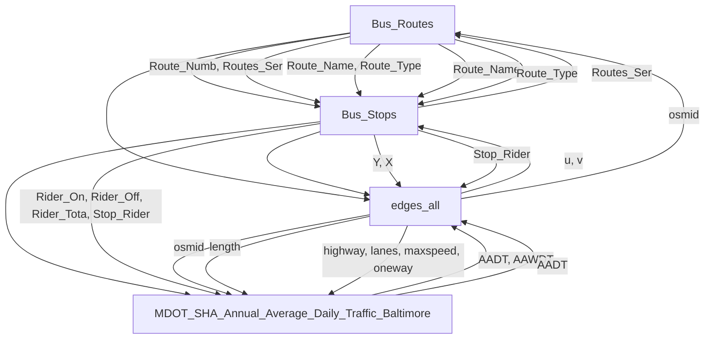

# [任务](../problem/CHINESE.md#任务需求)内容分析

## P0: 构建交通网络模型

> 偏向于交通网络的构建，以及对交通问题的分析，是一个较为复杂的引入性问题。

由于本题数据较多，需要先分析数据格式，理清数据之间的关系，更有助于问题的分析和求解，
而不是先入为主的去查看参考资料。带着数据去分析问题通常是关键。

已知这个问题需要构建交通网络模型，其中：
- node_all的geometry字段可以考虑和edges_all中的数据一同先构建一个大的网络。可以先进行数据的预处理，包括一致性检测，数据偏移修复；
- node_all的highway字段包括一些junction等标志，可以考虑人为的添加一些标签给没有标注的关键字段。

将关键点例如道路交叉口，公交站等地方添加标志。
Python实际建议考虑使用GeoPandas库，将图设计为networkx使用QGIS进行可视化。

### 数据理解

根据您提供的数据字典，以下是各个数据字段的中文解释和我对数据关系的简要理解：

#### 公交路线相关数据 Bus_Routes
- **Route_Name**: 公共交通路线的名称，例如公交或轨道路线。
- **Route_Type**: 路线所代表的公共交通服务类型，如公交车、快线、城市线等。
- **Route_Numb**: 路线的编号。
- **Distributi**: 可能指代客流量或交通数据的分布情况，如高峰时段与非高峰时段的对比。
- **Shape__Length**: 路线的长度，单位为GIS内部使用单位（如米）。

#### 公交站点数据 Bus_Stops
- **Y**: 站点的纬度坐标，用于地理定位。
- **X**: 站点的经度坐标，用于地理定位。
- **stop_name**: 站点的名称，可能包含街道方向信息。
- **Rider_On**: 在特定时间段内，上车的乘客数量。
- **Rider_Off**: 在特定时间段内，下车的乘客数量。
- **Rider_Tota**: 上车与下车乘客的总和。
- **Stop_Rider**: 站点的总乘客数（可能为Rider_On或Rider_Off的和）。
- **Routes_Ser**: 服务于该站点的交通路线，如公交、轨道等。
- **Mode**: 使用的交通方式，如公交、通勤公交等。
- **Shelter**: 是否有候车棚等设施。
- **County**: 该站点所在的县名。

#### 路网节点与边数据 nodes_all & nodes_drive
- **osmid**: 每个节点在OpenStreetMap中的唯一标识符。
- **y, x**: 节点的纬度与经度坐标。
- **street_count**: 一个节点与多少条道路相连，表示交叉口数量。
- **highway**: 道路类型，如住宅区道路、主干道等。
- **ref**: 道路的参考编号，如高速公路编号。
- **junction**: 该节点是否为交汇点，及其类型（如环形交叉口）。
- **geometry**: 节点或路段的空间表示，通常为线段或点。
  
#### 路网边数据 edges_all & edges_drive
- **u, v**: 图中边的起始节点和终止节点的OSM ID。
- **key**: 区分两个相同节点之间不同道路的唯一标识符。
- **osmid**: 路段的唯一标识符。
- **bridge**: 是否为桥梁。
- **lanes**: 路段的车道数。
- **maxspeed**: 路段的最大限速。
- **oneway**: 是否为单行道。
- **length**: 路段的长度，单位通常为米。
- **tunnel**: 是否为隧道。
  
#### 交通流量相关数据 MDOT_SHA_Annual_Average_Daily_Traffic_Baltimore
- **AADT (Annual Average Daily Traffic)**: 年度平均日交通量，表示某地点每天的平均交通量。
- **AAWDT (Annual Average Weekday Traffic)**: 年度平均工作日交通量，表示工作日的平均交通量。
- **Traffic Count Details**: 各年份的AADT、AAWDT等具体流量数据。

### 数据关系的理解
- **公交路线与公交站点**: 每个公交路线都有多个停靠的站点，每个站点服务不同的公交路线，可以通过“Routes_Ser”字段链接公交站点与其服务的公交路线。
- **站点乘客数据**: 通过“Rider_On”和“Rider_Off”字段，可以分析每个站点在特定时段的上下车人数，进而反映该站点的客流密度和出行模式。
- **路网与交通流量**: 每个道路节点（如“osmid”）与道路边（如“u, v”）构成了一个图模型，代表了路网的结构。节点连接的道路决定了交通流向和可能的瓶颈。而交通流量数据（如AADT）可以帮助评估路段的交通压力和优化方向。
- **高峰流量分析**: 交通流量数据（如“Peak Hour Direction”）可以用于分析不同时间段的流量变化，为交通网络优化提供依据。

## P1: 影响性评估

通过网络模型评估大桥倒塌或重建对交通系统和利益相关者的影响。

把握关键字“和”,意味着不仅是对交通系统的影响，还有相关者，可以去看一看参考文献。
有关于大桥的叙述，结合具体案例，但是不要仅限于此，可以考虑描述大桥的重要性，给出影响范围。

考虑一些指标性的数据，例如有无大桥时的通勤时间变化，道路负荷的变化，有无大桥对无大桥地区的交通情况影响等，
并不一定是需要经过大桥的道路会拥挤，这种情况会波及到所有地区。

## P2: 公交项目

把握本文的关键一个项目，评估影响，一定要拿出评估，并且在摘要和结论中重点叙述。

这里建议用公交系统，主要是由于数据中给出了bus_stop以及bus_routes的数据。

主要目标群体考虑低收入通勤者，工人，减少私家车。可能需要一些外部数据，例如社区收入情况调查，就业密度情况。
一定要评估影响，可以使用通勤时间变化，也可以使用道路拥挤情况，
但是一定要包括量化指标，要有严谨的计算过程，最后得出一个结论， 哪部分群体的通勤时间降低了x%。

## P3: 项目推荐

把握关键词一个“最”，主要候选项目有桥梁、公交、高速路。

一定要给出一个指标，说清楚为什么选x项目，可以考虑AHP分析，即多准则决策分析，权重可以自己设置，
例如经济效益，道路流量，社会福利等因素。

第二个关键词利益相关者影响，这个不仅包括受益的部分，还要包括不利的部分，例如资金，客流等方面。

可以从居民，工人，政府等方面进行一个多方面的影响评估，并且是一个定性叙述，性价比很高，可以体现出对问题的深度思考。

## P4: 安全性优化

1. 考虑到交通事故的发生，可以考虑在模型中加入一些安全性评估的指标，例如交通事故的发生率，交通事故的严重程度等。依托网络数据。
2. 考虑监控设备与交通信号的使用与优化，同时可以依托监控数据增强区域安全性。
3. 考虑区域安全的出警、救援等应急措施，以及应急通道的设置。
4. 考虑人、车、道路的分离。

## P5: 行政备忘录

___

## 参考库与工具

- Networkx-python 用于构建网络 
- GeoPandas-python 用于设计地理图格式
- Sumo-python 用于交通流模拟
