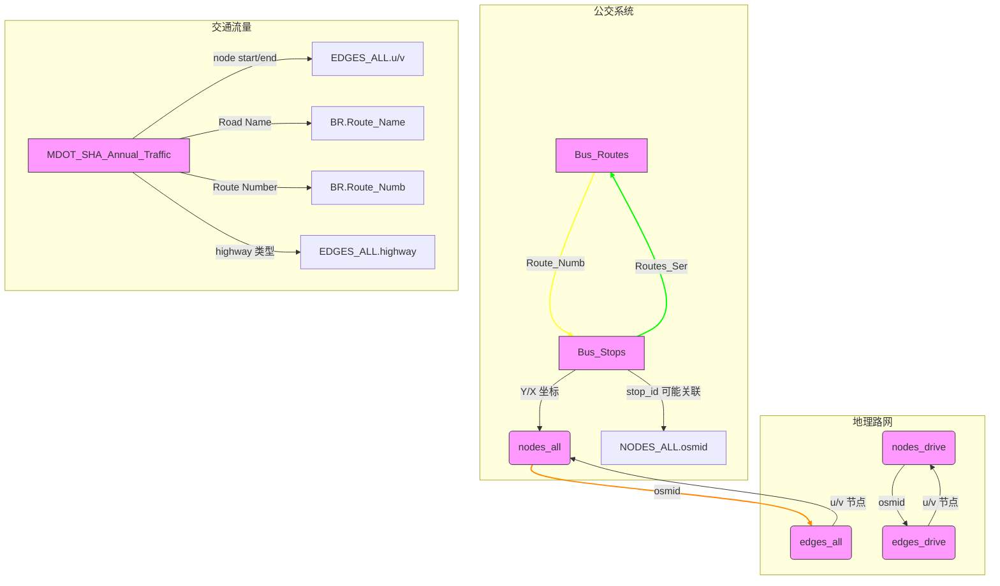

# [任务](../problem/CHINESE.md#任务需求)内容分析

## P0: 构建交通网络模型

> 偏向于交通网络的构建，以及对交通问题的分析，是一个较为复杂的引入性问题。

由于本题数据较多，需要先分析数据格式，理清数据之间的关系，更有助于问题的分析和求解，
而不是先入为主的去查看参考资料。带着数据去分析问题通常是关键。

已知这个问题需要构建交通网络模型，其中：
- node_all的geometry字段可以考虑和edges_all中的数据一同先构建一个大的网络。可以先进行数据的预处理，包括一致性检测，数据偏移修复；
- node_all的highway字段包括一些junction等标志，可以考虑人为的添加一些标签给没有标注的关键字段。

将关键点例如道路交叉口，公交站等地方添加标志。
Python实际建议考虑使用GeoPandas库，将图设计为networkx使用QGIS进行可视化。

### 数据解释

#### **1. Bus_Routes（公交路线表）**
- **Route_Name**: 公交路线名称，如“BALTIMORE - ANNAPOLIS”。
- **Route_Type**: 公交服务类型（如通勤巴士、快速公交等）。
- **Route_Numb**: 路线编号（如“Route 22”）。
- **Distributi**: 客流量分布标签（内部使用）。
- **Shape__Length**: GIS中路线长度（内部单位）。

#### **2. Bus_Stops（公交站点表）**
- **Y/X**: 站点经纬度坐标。
- **stop_name**: 站点名称（含街道和方向信息）。
- **Rider_On/Off/Total/Stop_Rider**: 上下车乘客数及总计。
- **Routes_Ser**: 站点服务的公交路线列表。
- **Distributi**: 客流量分布标签（内部使用）。
- **Mode**: 交通模式（如“Bus”）。
- **Shelter**: 是否有候车亭（yes/no）。
- **County**: 站点所属县。
- **stop_id**: 站点唯一标识符。

#### **3. nodes_all & nodes_drive（节点表）**
- **osmid**: OSM节点唯一ID。
- **y/x**: 节点经纬度。
- **street_count**: 连接道路数（反映交叉口复杂度）。
- **highway**: 道路类型（如residential、motorway）。
- **ref**: 道路编号（如“I-80”）。
- **railway/junction**: 铁路或交叉口类型。
- **geometry**: 空间几何信息（点）。

#### **4. edges_all & edges_drive（道路边表）**
- **u/v**: 边的起点/终点节点ID。
- **key**: 区分同一节点间多条边的标识。
- **osmid**: OSM边唯一ID。
- **bridge/tunnel**: 是否为桥梁/隧道。
- **highway**: 道路类型（与节点表一致）。
- **lanes/maxspeed/oneway**: 车道数、限速、单双向。
- **length**: 路段长度（米）。
- **geometry**: 空间几何信息（线）。
- **name/service/access**: 道路名称、服务类型、访问权限。

#### **5. MDOT_SHA_Annual_Average_Daily_Traffic_Baltimore（交通流量表）**
- **node start/end**: 路段起止节点ID。
- **GIS Object ID**: 地理对象唯一ID。
- **Station ID/County Code**: 交通监测站信息。
- **Road Name/Route Number**: 道路名称与编号。
- **Functional Class**: 道路功能分类（如主干道）。
- **AADT/AAWDT (2014-2020)**: 年度日均/工作日均车流量。
- **AADT分车型数据**: 摩托车、小汽车、卡车等流量。
- **Shape__Length0/GIS Shape Length**: 路段GIS长度。

### **数据关系理解**
1. **公交系统与地理网络的关联**  
   - **Bus_Routes** 与 **Bus_Stops** 通过 `Routes_Ser` 字段关联，可分析路线覆盖与站点客流。
   - 公交站点坐标（`Y/X`）可与 **nodes_all** 中的节点坐标匹配，确定站点在路网中的位置。

2. **交通路网建模**  
   - **nodes_all/drive** 和 **edges_all/drive** 构成路网拓扑结构：
     - **nodes_drive** 可能仅包含车辆通行节点（如排除步行道）。
     - **edges_drive** 包含车辆相关属性（车道数、限速），支持路径规划算法（如Dijkstra）。

3. **流量数据与路网集成**  
   - 交通流量表通过 `node start/end` 与 **edges_all** 的 `u/v` 关联，将流量统计映射到具体路段。
   - 分车型流量（如AADT Truck）可结合 `edges_drive` 的 `highway` 类型（如主干道 vs 支路）分析货运路线。

4. **空间分析**  
   - 所有表的 `geometry` 字段支持GIS可视化与空间计算（如缓冲区分析站点覆盖范围）。
   - **Shape__Length** 字段用于计算路线或路段实际长度，辅助交通效率评估。

### **关键注意事项**
1. **数据完整性**  
   - `Distributi` 字段标注为内部使用，可能需权限或额外解释。
   - 流量表中的 `Location Error` 字段全为空，需确认是否为数据缺失。

2. **字段映射**  
   - **Bus_Stops** 的 `stop_id` 可能与 **nodes_all** 的 `osmid` 需对齐（需验证坐标一致性）。
   - 交通流量表的 `Route Number` 需与 **Bus_Routes** 的 `Route_Numb` 关联，分析公交对道路流量的影响。

3. **驾驶相关数据分离**  
   - **nodes_drive** 和 **edges_drive** 需单独处理，可能用于车辆专用分析（如拥堵预测），而 **nodes_all/edges_all** 包含全模式路网。

## P1: 影响性评估

通过网络模型评估大桥倒塌或重建对交通系统和利益相关者的影响。

把握关键字“和”,意味着不仅是对交通系统的影响，还有相关者，可以去看一看参考文献。
有关于大桥的叙述，结合具体案例，但是不要仅限于此，可以考虑描述大桥的重要性，给出影响范围。

考虑一些指标性的数据，例如有无大桥时的通勤时间变化，道路负荷的变化，有无大桥对无大桥地区的交通情况影响等，
并不一定是需要经过大桥的道路会拥挤，这种情况会波及到所有地区。

## P2: 公交项目

把握本文的关键一个项目，评估影响，一定要拿出评估，并且在摘要和结论中重点叙述。

这里建议用公交系统，主要是由于数据中给出了bus_stop以及bus_routes的数据。

主要目标群体考虑低收入通勤者，工人，减少私家车。可能需要一些外部数据，例如社区收入情况调查，就业密度情况。
一定要评估影响，可以使用通勤时间变化，也可以使用道路拥挤情况，
但是一定要包括量化指标，要有严谨的计算过程，最后得出一个结论， 哪部分群体的通勤时间降低了x%。

## P3: 项目推荐

把握关键词一个“最”，主要候选项目有桥梁、公交、高速路。

一定要给出一个指标，说清楚为什么选x项目，可以考虑AHP分析，即多准则决策分析，权重可以自己设置，
例如经济效益，道路流量，社会福利等因素。

第二个关键词利益相关者影响，这个不仅包括受益的部分，还要包括不利的部分，例如资金，客流等方面。

可以从居民，工人，政府等方面进行一个多方面的影响评估，并且是一个定性叙述，性价比很高，可以体现出对问题的深度思考。

## P4: 安全性优化

1. 考虑到交通事故的发生，可以考虑在模型中加入一些安全性评估的指标，例如交通事故的发生率，交通事故的严重程度等。依托网络数据。
2. 考虑监控设备与交通信号的使用与优化，同时可以依托监控数据增强区域安全性。
3. 考虑区域安全的出警、救援等应急措施，以及应急通道的设置。
4. 考虑人、车、道路的分离。

## P5: 行政备忘录

___

## 参考库与工具

- Networkx-python 用于构建网络 
- GeoPandas-python 用于设计地理图格式
- Sumo-python 用于交通流模拟
