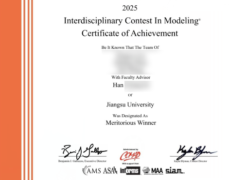

# **MCM/ICM** _(2025)_ Problem D: A Roadmap to a Better City

This project is a solution to the 2025 ICM Problem D using [Python]() and [LaTex](), with the following sections:

1. introduction of the problem
2. the mathematical model,
3. the algorithm design and implementation.

## Problem

See the [original](.doc/problem/ORIGINAL.md) or [Chinese Version](.doc/problem/CHINESE.md)
for problem description and requirements.

## Graphical Model

We have created some graphical models for the problem, see [GitHub Pages](https://carmjos.github.io/MCM-ICM.2025.D/).

|    **Type**     |                               **Link**                                | **Description**                            |            
|:---------------:|:---------------------------------------------------------------------:|--------------------------------------------|
| Important Nodes | [Jump](https://carmjos.github.io/MCM-ICM.2025.D/important_nodes.html) | Important nodes (by TOPSIS) in the network |

| **Year** |                 **Annual Average Daily Traffic** _(AADT)_                  |             **Annual Average Workday Daily Traffic** _(AAWDT)_              |
|:--------:|:--------------------------------------------------------------------------:|:---------------------------------------------------------------------------:|
|   2014   |  [Jump](https://carmjos.github.io/MCM-ICM.2025.D/traffic/aadt/2014.html)   |  [Jump](https://carmjos.github.io/MCM-ICM.2025.D/traffic/aawdt/2014.html)   |
|   2015   |  [Jump](https://carmjos.github.io/MCM-ICM.2025.D/traffic/aadt/2015.html)   |  [Jump](https://carmjos.github.io/MCM-ICM.2025.D/traffic/aawdt/2015.html)   |
|   2016   |  [Jump](https://carmjos.github.io/MCM-ICM.2025.D/traffic/aadt/2016.html)   |  [Jump](https://carmjos.github.io/MCM-ICM.2025.D/traffic/aawdt/2016.html)   |
|   2017   |  [Jump](https://carmjos.github.io/MCM-ICM.2025.D/traffic/aadt/2017.html)   |  [Jump](https://carmjos.github.io/MCM-ICM.2025.D/traffic/aawdt/2017.html)   |
|   2018   |  [Jump](https://carmjos.github.io/MCM-ICM.2025.D/traffic/aadt/2018.html)   |  [Jump](https://carmjos.github.io/MCM-ICM.2025.D/traffic/aawdt/2018.html)   |
|   2019   |  [Jump](https://carmjos.github.io/MCM-ICM.2025.D/traffic/aadt/2019.html)   |  [Jump](https://carmjos.github.io/MCM-ICM.2025.D/traffic/aawdt/2019.html)   |
|   2020   |  [Jump](https://carmjos.github.io/MCM-ICM.2025.D/traffic/aadt/2020.html)   |  [Jump](https://carmjos.github.io/MCM-ICM.2025.D/traffic/aawdt/2020.html)   |
|   2021   |  [Jump](https://carmjos.github.io/MCM-ICM.2025.D/traffic/aadt/2021.html)   |  [Jump](https://carmjos.github.io/MCM-ICM.2025.D/traffic/aawdt/2021.html)   |
| Current  | [Jump](https://carmjos.github.io/MCM-ICM.2025.D/traffic/aadt/current.html) | [Jump](https://carmjos.github.io/MCM-ICM.2025.D/traffic/aawdt/current.html) |

## Issues

If you have any questions or suggestions, 
please [open an issue](https://github.com/CarmJos/CarmJos/issues/new?template=Blank+issue)
or email me at [carm@carm.cc](mailto:carm@carm.cc).

## Open Source Licence

The source code of this project adopts the [GNU General Public License v3.0](https://opensource.org/licenses/GPL-3.0).

## Acknowledgements

We was designated as **Meritorious Winner** _(also known as First Prize)_ in this contest.

Many thanks to **our advisor (Mr. Han)** for his well guidance and tremendous support.

Many thanks to **our team members (@CarmJos, @WangGold3, @hanghangz628)** for their hard work and dedication.

Many thanks to **Jetbrains** for kindly providing a license for us to work on this and other open-source projects.  

